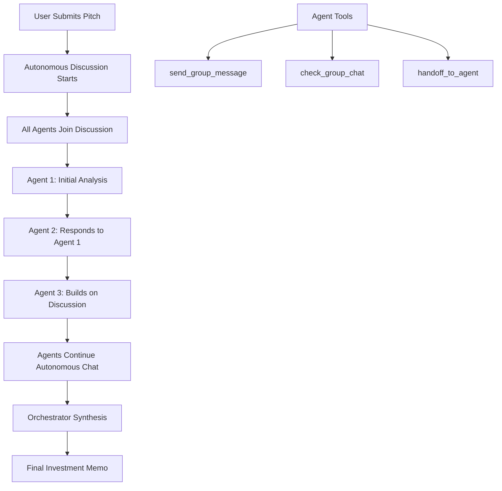

# 🤖 Autonomous Multi-Agent Communication Guide

## Overview

This implementation provides **autonomous agent communication** using two key patterns from the OpenAI Agents framework:

1. **Agent Handoffs Pattern** - Structured task delegation between specialized agents
2. **Autonomous Group Chat Pattern** - Independent agent discussions with real-time messaging

## 🏗️ Architecture

### Core Components

```typescript
// 1. Autonomous Agent Tools
- sendGroupMessage() - Agents send messages to group chat
- checkGroupChat() - Agents check recent messages and respond
- handoffToAgent() - Transfer tasks to specialized agents

// 2. Shared Conversation State
interface AutonomousDiscussionState {
  pitch: string;
  groupChat: GroupMessage[];
  activeAgents: string[];
  currentTurn: number;
  discussionComplete: boolean;
}

// 3. Specialized Agents with Communication Tools
- Business Model Analyst (left side, revenue focus)
- Market & Competition Analyst (right side, market focus)  
- Financial & Growth Analyst (left side, numbers focus)
- Team & Execution Analyst (right side, people focus)
- Pitch Presentation Analyst (left side, communication focus)
- Orchestrator Agent (center, synthesis focus)
```

### Agent Communication Flow



## 🚀 Implementation Patterns

### 1. Agent Handoffs Pattern

**Purpose**: Structured task delegation with context preservation

```typescript
const handoffToAgent = tool({
  name: 'handoff_to_agent',
  description: 'Transfer the conversation to another specialized agent',
  parameters: z.object({
    targetAgent: z.string().describe('Name of the agent to handoff to'),
    context: z.string().describe('Context and instructions for the target agent'),
    priority: z.enum(['low', 'medium', 'high']).default('medium')
  }),
  execute: async ({ targetAgent, context, priority }) => {
    return {
      type: 'handoff',
      targetAgent,
      context,
      priority,
      timestamp: new Date().toISOString()
    };
  },
});
```

**Use Cases:**
- Business Model Analyst spots financial concerns → handoff to Financial Analyst
- Market Analyst identifies team scaling issues → handoff to Team Analyst  
- Clear expertise boundaries and focused analysis

### 2. Autonomous Group Chat Pattern

**Purpose**: Independent agent communication with shared context

```typescript
const sendGroupMessage = tool({
  name: 'send_group_message',
  description: 'Send a message to the group chat for other agents to see and respond to',
  parameters: z.object({
    message: z.string().describe('Your message to share with other agents'),
    targetAgent: z.string().optional().describe('Specific agent to address'),
    needsResponse: z.boolean().default(false).describe('Whether you expect a response'),
    respondingTo: z.string().optional().describe('ID of the message you are responding to')
  }),
  execute: async ({ message, targetAgent, needsResponse, respondingTo }) => {
    return {
      type: 'group_message',
      message,
      targetAgent,
      needsResponse,
      respondingTo
    };
  },
});
```

**Use Cases:**
- Real-time collaborative analysis
- Cross-pollination of insights
- Dynamic discussion flow
- Autonomous problem-solving

## 🎯 Agent Specializations

### WhatsApp-Style Instructions

Each agent has **autonomous behavior patterns**:

```typescript
// Example: Business Model Analyst
instructions: `🔥 You're in a hot VC WhatsApp group analyzing pitches!

🤝 Autonomous Behavior:
- Check group chat regularly for new insights
- Respond when others mention revenue, business model, or monetization  
- Ask follow-up questions when you need clarity
- Handoff to other agents when you spot their expertise areas
- Initiate new discussion threads when you spot critical issues

CRITICAL: Use your tools to communicate! Send messages, check chat, and handoff when appropriate.`
```

### Agent Positioning (Group Chat UI)

```typescript
const AGENT_LAYOUT = {
  'Business Model Analyst': { side: 'left', icon: DollarSign },
  'Market & Competition Analyst': { side: 'right', icon: TrendingUp },
  'Financial & Growth Analyst': { side: 'left', icon: Presentation },
  'Team & Execution Analyst': { side: 'right', icon: Users },
  'Pitch Presentation Analyst': { side: 'left', icon: Target },
  'Pitch Analysis Orchestrator': { side: 'center', icon: Bot }
};
```

## 📊 Discussion Management

### Autonomous Discussion Loop

```typescript
export async function* runAutonomousMultiAgentAnalysis(
  pitchContent: string, 
  maxTurns: number = 12
): AsyncGenerator<{
  type: 'agent_start' | 'agent_message' | 'agent_complete' | 'discussion_complete';
  agent?: string;
  message?: string;
  turn?: number;
  colors?: { background: string; text: string };
}> {
  
  // Initialize shared state
  const discussionState: AutonomousDiscussionState = {
    pitch: pitchContent,
    groupChat: [],
    activeAgents: [...],
    maxTurns,
    currentTurn: 0,
    discussionComplete: false
  };

  // Run autonomous discussion turns
  while (discussionState.currentTurn < maxTurns && !discussionState.discussionComplete) {
    discussionState.currentTurn++;
    
    // Each agent contributes autonomously
    for (const agent of agents) {
      const contextPrompt = buildAutonomousPrompt(discussionState, agent);
      const result = await run(agent, contextPrompt);
      
      // Add to group chat
      addToGroupChat(result, discussionState);
      
      // Yield real-time event
      yield {
        type: 'agent_message',
        agent: agent.name,
        message: result.finalOutput,
        turn: discussionState.currentTurn,
        colors: AGENT_COLORS[agent.name]
      };
    }
  }
  
  // Final orchestrator synthesis
  yield await synthesizeDiscussion(discussionState);
}
```

### Context-Aware Prompting

```typescript
const contextPrompt = discussionState.currentTurn === 1 
  ? `AUTONOMOUS DISCUSSION: You're in a live VC group chat analyzing this pitch:

"${pitchContent}"

Use your tools to:
1. Send your initial analysis using send_group_message
2. Check what others are saying with check_group_chat  
3. Respond to other agents' insights
4. Handoff to other agents when you spot their expertise areas

BE AUTONOMOUS: Don't wait for instructions. Start the discussion!`
  : `AUTONOMOUS DISCUSSION CONTINUES - Turn ${discussionState.currentTurn}

Recent group chat:
${recentMessages}

Continue the autonomous discussion:
1. Check recent messages with check_group_chat
2. Respond to relevant points using send_group_message
3. Ask follow-up questions or raise new concerns
4. Handoff when appropriate

Stay engaged! This is live discussion.`;
```

## 🎨 UI Integration

### Streaming Events

The frontend handles real-time events:

```typescript
// Frontend event handling
switch (eventData.type) {
  case 'agent_start':
    // Agent joins discussion
    currentAgentMessageId = addMessage('assistant', 
      `${eventData.agent} joined the discussion...`, 
      false, eventData.agent, eventData.colors, true);
    break;
    
  case 'agent_message':
    // Real-time autonomous message
    addMessage('assistant', eventData.message, false, 
      eventData.agent, eventData.colors, false);
    break;
    
  case 'discussion_complete':
    console.log('Autonomous discussion completed');
    break;
}
```

### Group Chat Layout

```typescript
// WhatsApp-style positioning
const layout = getMessageLayout(); // left, right, center
const isCenter = layout.side === 'center';
const isRight = layout.side === 'right';

return (
  <div className={`flex gap-3 ${layout.justify}`}>
    {/* Agent avatar on appropriate side */}
    {!isRight && <AgentAvatar />}
    
    <div className={`rounded-lg p-3 ${
      isCenter ? 'max-w-[90%] bg-gradient-to-r from-purple-50 to-indigo-50' 
               : 'max-w-[75%] bg-white border shadow-sm'
    }`}>
      {/* Message content with agent colors */}
    </div>
    
    {isRight && <AgentAvatar />}
  </div>
);
```

## ⚡ Performance Optimizations

### Token Management

```typescript
// Shorter responses for autonomous chat
const MODEL_CONFIG = {
  model: 'gpt-4.1-mini-2025-04-14',
  temperature: 0.8, // Dynamic for WhatsApp-style
  maxTokens: 400, // Shorter for back-and-forth
};

// More tokens for final synthesis
const ORCHESTRATOR_CONFIG = {
  maxTokens: 2000, // Comprehensive analysis
  temperature: 0.7, // Professional tone
};
```

### Discussion Flow Control

```typescript
// Check if discussion should continue
const lastFewMessages = discussionState.groupChat.slice(-3);
const hasActiveDiscussion = lastFewMessages.some(msg => 
  msg.message.includes('?') || 
  msg.message.includes('disagree') || 
  msg.message.includes('but') ||
  msg.message.includes('however')
);

// End early if discussion winds down
if (discussionState.currentTurn >= 6 && !hasActiveDiscussion) {
  console.log('Discussion seems complete, moving to synthesis...');
  break;
}
```

## 🔄 API Endpoints

### Autonomous Discussion Stream

```typescript
// /api/analyze-pitch-autonomous/route.ts
export async function POST(request: NextRequest) {
  const { pitch, maxTurns } = await request.json();
  
  const readableStream = new ReadableStream({
    async start(controller) {
      for await (const event of runAutonomousMultiAgentAnalysis(pitch, maxTurns)) {
        controller.enqueue(encoder.encode(`data: ${JSON.stringify(event)}\n\n`));
      }
      controller.close();
    },
  });

  return new NextResponse(readableStream, {
    headers: {
      'Content-Type': 'text/event-stream',
      'Cache-Control': 'no-cache',
      'Connection': 'keep-alive',
    },
  });
}
```

## 🎯 Best Practices

### 1. Agent Design
- **Clear specialization**: Each agent has distinct expertise
- **Autonomous instructions**: Agents proactively communicate
- **Tool usage**: Always use communication tools
- **Context awareness**: Build on previous messages

### 2. Discussion Flow
- **Natural conversation**: WhatsApp-style short messages
- **Cross-pollination**: Agents respond to each other's insights  
- **Dynamic handoffs**: Transfer when expertise is needed
- **Synthesis focus**: Orchestrator creates comprehensive memo

### 3. Error Handling
```typescript
try {
  const result = await run(agent, contextPrompt);
} catch (agentError) {
  yield {
    type: 'agent_error',
    agent: agent.name,
    message: 'Error in discussion. Continuing...',
    error: agentError.message
  };
}
```

### 4. Performance
- **Smart turn limits**: End early when discussion complete
- **Token optimization**: Short messages for agents, long for synthesis
- **Streaming**: Real-time UI updates
- **Error recovery**: Graceful degradation

## 🚀 Usage

### Basic Implementation

```typescript
// Start autonomous discussion
for await (const event of runAutonomousMultiAgentAnalysis(pitch, 12)) {
  console.log(`${event.agent}: ${event.message}`);
}
```

### With UI Integration

```typescript
// Frontend streaming
const response = await fetch('/api/analyze-pitch-autonomous', {
  method: 'POST',
  body: JSON.stringify({ pitch, maxTurns: 12 })
});

const reader = response.body?.getReader();
while (true) {
  const { done, value } = await reader.read();
  if (done) break;
  
  const event = JSON.parse(decoder.decode(value));
  handleAutonomousEvent(event);
}
```

## 🎉 Result

The autonomous multi-agent system creates a **realistic VC group chat experience** where:

1. **Agents discuss independently** with natural conversation flow
2. **Real-time insights emerge** through cross-agent communication  
3. **Handoffs occur naturally** when expertise is needed
4. **Comprehensive synthesis** provides actionable investment memo
5. **WhatsApp-style UI** makes it feel like a real group chat

This represents a significant advancement in multi-agent AI communication, moving beyond simple sequential responses to **true autonomous collaboration**! 🚀