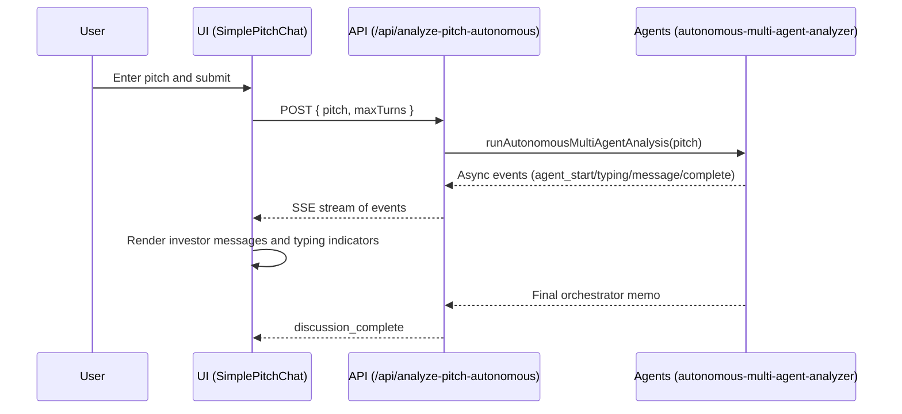

## Sharks (Løvens Hule Group Chat) — Codebase Overview

This document explains what the app does, how it’s structured, and how data flows from the UI to the AI agents and back. It also lists known gaps and suggestions for next steps.

### What this app is
- **Concept**: A fun, autonomous agent experience where a user submits a startup pitch and a group of Danish “Løvens Hule” investors discuss it in a realistic group chat.
- **Tech**: Next.js App Router + React 19, Tailwind CSS, and `@openai/agents` for personality-driven AI agents.

---

## High-level architecture

- **UI**: `src/app/page.tsx` renders the pitch input → spawns the full-screen WhatsApp-like chat UI `src/components/chat/SimplePitchChat.tsx`.
- **API**: `src/app/api/analyze-pitch-autonomous/route.ts` receives the pitch and streams back events as Server-Sent Events (SSE).
- **Agents**: `src/lib/agents/autonomous-multi-agent-analyzer.ts` defines:
  - 5 investor agents (Jakob, Jesper, Jan, Christian, Tahir)
  - An Orchestrator agent (“Investment Committee Lead”)
  - The autonomous discussion loop and streaming event generator

#### Sequence (end‑to‑end)


---

## Key modules and responsibilities

### UI
- `src/app/page.tsx`
  - Shows a simple text area for the pitch.
  - On submit, opens `SimplePitchChat` in autonomous mode with a configurable `maxTurns`.

- `src/components/chat/SimplePitchChat.tsx`
  - Renders the WhatsApp-style interface and avatars.
  - Calls `/api/analyze-pitch-autonomous` and consumes an SSE stream.
  - Displays events: typing start/stop, agent messages, orchestrator synthesis, and completion.
  - Minimal state helpers for message list, auto-scroll, and unique IDs.

- `src/components/ui/button.tsx`
  - Themed `Button` built with `class-variance-authority` and Tailwind.

### API
- `src/app/api/analyze-pitch-autonomous/route.ts`
  - Validates input and presence of `OPENAI_API_KEY`.
  - Creates a `ReadableStream` and forwards events from `runAutonomousMultiAgentAnalysis(...)` as SSE (`data: {json}\n\n`).
  - Small delay for agent_message events for UX.

### Agents and orchestration
- `src/lib/agents/autonomous-multi-agent-analyzer.ts`
  - Exports constants: `MODEL_CONFIG`, `ORCHESTRATOR_CONFIG`, `AGENT_COLORS`.
  - Defines agent “tools” (group message, chat check, handoff) via `@openai/agents` `tool(...)` API.
  - Defines 5 real investors as `Agent` instances with strong persona instructions (Danish tone) and the `Investment Committee Lead` orchestrator.
  - Uses `run(agent, prompt)` from `@openai/agents` to get live model output.
  - Implements selection logic `letOrchestratorDecideNextAgent(...)` that asks the orchestrator which investor should speak next, with a fallback to “least active”.
  - Provides `processAgentResponse(...)` that yields typing events, performs natural delays, generates a response, and yields message events.
  - Exposes the core async generator `runAutonomousMultiAgentAnalysis(pitch, maxTurns)` that streams all events, and a wrapper `runAutonomousMultiAgentPitchAnalysis(...)` that aggregates into a final result for non-streaming contexts.

---

## Streaming protocol (SSE)
The API streams newline-delimited server-sent events with a `data: {json}` payload. The client splits by line and parses JSON.

Event `type` values observed:
- `agent_start` — an agent is joining/starting a turn
- `agent_typing_start` / `agent_typing_stop` — used for UI typing indicators
- `agent_message` — a full AI message from an investor
- `agent_complete` — orchestrator’s final memo
- `agent_error` — agent‑specific error, UI should continue
- `discussion_complete` — signals end of conversation
- `stream_complete` — API closes the stream

---

## Environment and configuration
- `OPENAI_API_KEY` — must be set in the server environment.
- `OPENAI_MODEL` (optional) — overrides defaults in `MODEL_CONFIG` and `ORCHESTRATOR_CONFIG`.
- `export const runtime = 'nodejs'` in the API route ensures Node runtime for the `@openai/agents` SDK.

---

## Notable implementation details (with tiny code comments)

```ts
// src/lib/agents/autonomous-multi-agent-analyzer.ts
// Agent color theme used by the chat UI to style bubbles
export const AGENT_COLORS = { /* name -> { background, text } */ } as const;

// Picks who speaks next by asking the orchestrator (fallbacks to least active)
async function letOrchestratorDecideNextAgent(agents, discussionState, agentParticipation) { /* ... */ }

// Wraps typing start/stop, delay, LLM call, and yields message events
async function* processAgentResponse(agent, prompt, discussionState, delayCfg) { /* ... */ }

// Core generator producing the entire autonomous discussion stream
export async function* runAutonomousMultiAgentAnalysis(pitchContent: string, maxTurns = 10) { /* ... */ }

// Wrapper that aggregates generator events into a single result (non-streaming use)
export async function runAutonomousMultiAgentPitchAnalysis(pitchContent: string, maxTurns = 10) { /* ... */ }
```

```ts
// src/app/api/analyze-pitch-autonomous/route.ts
// Streams Autonomous discussion events as SSE to the client
export async function POST(req) {
  const { pitch, maxTurns } = await req.json();
  const stream = new ReadableStream({
    async start(controller) {
      for await (const event of runAutonomousMultiAgentAnalysis(pitch, maxTurns || 6)) {
        controller.enqueue(encoder.encode(`data: ${JSON.stringify(event)}\n\n`));
      }
      controller.enqueue(encoder.encode('data: {"type": "stream_complete"}\n\n'));
      controller.close();
    }
  });
  return new NextResponse(stream, { headers: { 'Content-Type': 'text/event-stream' } });
}
```

```ts
// src/components/chat/SimplePitchChat.tsx
// Connects to the SSE endpoint and renders investor messages
const response = await fetch('/api/analyze-pitch-autonomous', { method: 'POST', body: JSON.stringify({ pitch, maxTurns }) });
const reader = response.body?.getReader();
// Read stream, split by lines starting with 'data: ', parse and handle event types
```

---

## Assets
- Investor avatars live in `public/assets/investors/`. The chat maps names → files.
- Note: The chat references `'/assets/investors/orchestrator.jpg'` for the orchestrator, but that file does not exist in the repo. It will fall back to the default avatar.

---

## Local development
- Install: `npm i`
- Run: `npm run dev`
- Open: `http://localhost:3000`
- Ensure `OPENAI_API_KEY` is set in your environment (e.g., `.env.local`).

---

## Extensibility
- **Add a new investor**
  - Create a new `Agent` with persona and `tools`.
  - Add to `AGENT_COLORS` and to the `agents` array in `runAutonomousMultiAgentAnalysis(...)`.
  - Provide an avatar in `public/assets/investors/` and map it in `getInvestorAvatar`.

- **Tune the flow**
  - Adjust `CONVERSATION_TIMING` for delays and follow-up probability.
  - Change `maxTurns` passed by the UI or API default.
  - Update orchestrator instructions to alter conversation balance and memo format.

---

## Known gaps and opportunities
- **Missing endpoint**: UI references `'/api/analyze-pitch-stream'` for non‑autonomous modes; it isn’t implemented. Either add the route or remove the unused mode(s).
- **Orchestrator avatar**: `'/assets/investors/orchestrator.jpg'` is referenced but missing.
- **Resilience**: Consider exponential backoff or reconnection logic if SSE drops.
- **Validation**: Add input validation with `zod` on the API boundary.
- **Rate limiting**: Add basic rate limits to protect the endpoint.
- **Observability**: Add logging metadata and (optional) analytics on agent turns.

---

## Quick mental model
- The app is a stateful chat UI that connects to an SSE endpoint.
- The endpoint streams a deterministic sequence of events driven by an orchestrator agent.
- The orchestrator uses recent context and participation counts to decide the next speaker.
- Each agent produces a short, persona-aligned response with natural delays to mimic chat.
- The orchestrator finishes with a structured Danish investment memo.


